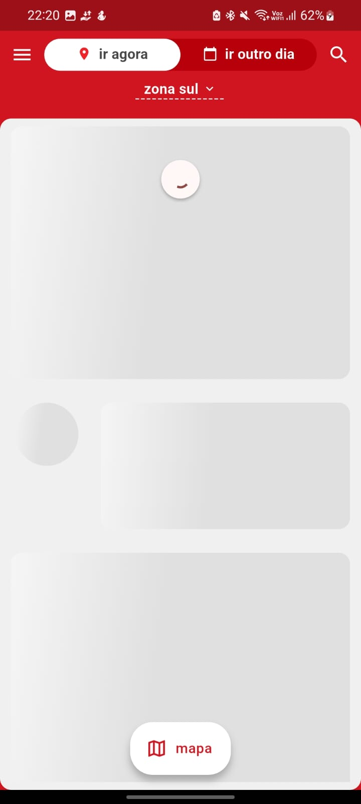

# Processo Seletivo - Dev Flutter Senior - Guia de Motéis

## Descrição do Projeto
Este projeto foi desenvolvido como parte de um processo seletivo para a vaga de Desenvolvedor Flutter Sênior na empresa **Guia de Motéis**.
Para realização do projeto utilizei um quadro no Notion para organização de demandas: [Quadro Notion](https://fanatical-telephone-676.notion.site/cba54cd18a0447aaaa8395b0897d4c5f?v=23cd867f09ee4f85813ea0187b31d7e6)

## Vídeo Apresentação
🎥 [Clique aqui para assistir ao vídeo](https://drive.google.com/file/d/1wg3IUUQcn8jC4K_izacrpnUlYGGHcbiU/view?usp=sharing)

### Desafio
O objetivo do desafio foi criar uma réplica da tela de listagem de motéis (aba "Ir Agora") do aplicativo **Guia de Motéis GO**, utilizando os dados provenientes de APIs mock fornecidas. O desafio envolveu o uso de **Flutter** e **Dart**, com foco no gerenciamento de estado, consumo de API e implementação de testes unitários.

### Requisitos
- Exibir a listagem de motéis com **nome**, **preço** e **imagem**.
- O design não precisa ser 100% fiel, com a possibilidade de usar ícones alternativos ou variações visuais.
- Não é necessário implementar navegação para outras telas.
- Implementação de **testes unitários** cobrindo os principais componentes da aplicação.

### Requisitos Técnicos
- **Flutter** e **Dart** para o desenvolvimento do aplicativo.
- **API Mock** utilizando os links fornecidos:
  - [Link 1](https://jsonkeeper.com/b/1IXK)
  - [Link 2](https://www.npoint.io/docs/e728bb91e0cd56cc0711)
- **Gerenciamento de Estado** utilizando **Provider**.
- **Testes Unitários** implementados para garantir o funcionamento correto da listagem.
- Repositório do código no **GitHub** (público ou privado).

---

## Tecnologias Usadas
- **Flutter 3.27.1**
- **Dart 3.6.0**
- **Provider** para gerenciamento de estado.
- **http** para consumo das APIs.
- **Shimmer** para efeitos de carregamento.
- **Mockito** para testes unitários.

---

## Instalação e execução

Para rodar este projeto, siga os passos abaixo:

1. **Clonar o repositório**:
   ```bash
   git clone <URL_DO_REPOSITORIO>
2. **Navegar até a pasta do projeto**:
   ```bash
   cd <DIRETORIO_PROJETO>
3. **Instalar as dependências**:
   ```bash
   flutter pub get
4. **Rodar o aplicativo**:
   ```bash
   flutter run

## Testes
1. **Testes Unitários: Para rodar os testes unitários do projeto, execute**:
   ```bash
   flutter test

## Estrutura de diretórios
    core/
    │── config
    │── constants
    │── di
    │── http_client
    │── instance_manager
    │── measurements
    │── resources
    modules/
    │── go_now
    │── shared
## Descrição das Pastas
- **core/**: Contém configurações gerais, constantes, gerenciadores de instância, e lógica de HTTP.
- **modules/**: Contém os módulos principais do aplicativo, como go_now e shared, onde ficam as páginas, widgets e lógica de negócios.
- **presentation/**: Contém as páginas e widgets usados na interface do usuário.
- **data/**: Contém a camada de dados, com modelos e implementação de repositórios.
- **domain/**: Contém entidades, interfaces e casos de uso.


---

## APK para Testes

Para instalar o aplicativo no seu dispositivo, você pode baixar o APK diretamente através do link abaixo:

[Baixar APK](https://github.com/Hugerds/guiago/raw/main/guia_go_hugerds.apk)


## Resultados




---
